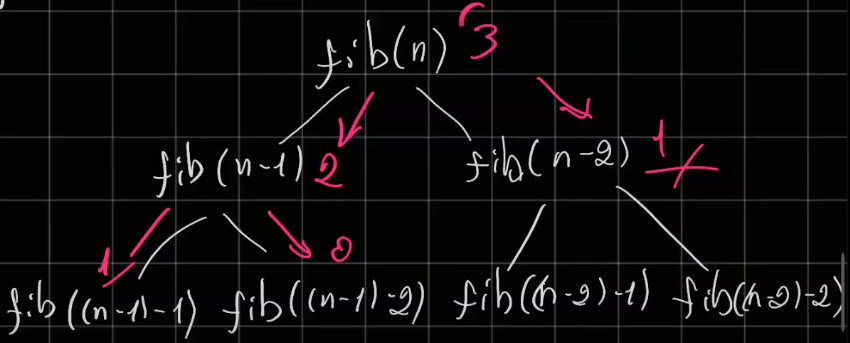

# Análise de Algoritmos:
- Verificar quanto de recursos será necessário pelo computador para resolver o problema
    - Tempo
    - Memória
    - Notação Big O

## Dado o vetor quel é o melhor caso, médio e pior?
       
[1, 9, 7, 6, 5, 2, 3, 4, 8, 10]

- Find(x) -> índice (posição de x)
    - melhor caso: find(1) -> 0
    - médio caso: find(2) -> 5
    - pior caso: find(10) -> 9

## Representação:
BigO:  
O(função da complexidade)

## Constante

```c
int main(){
    int x;
    scanf("%d", &x);
    printf("%d\n", x);
}
```

- Suponhamos que estamos em uma máquina perfeita
- Independentemente do valor de x, o tempo sempre será 1ms
- Ou seja este número não influência o número de operações no meu programa
- O(1), o código acima independentemente do valor de x tem um custo constante

## Linear

```c
int main(){
    int x, sum = 0;
    scanf("%d", &x);
    for(int i=1; i < = x; i++){
        sum += i;
    }
}
```
- Dependendo da entrada que eu coloco, a quantidade de recurso muda:
    - Se eu coloco 20, meu programa roda 20x
    - 1.000.000 meu programa roda 1.000.000x
    - Então ele é proporcional ao tamanho da minha entrada
- O(x)
    - É o O daquela variável que influência meu código
- Lembre-se as Constantes são irrisórias

## Quadrática

```c
int main(){
    int n, sum = 0;
    scanf("%d", &n);
    for(int i=1; i < = x; i++){
        for(int k = 1; k < = n; k++){
            sum += i;
        }
    }
}
```
- O meu for de dentro vai executar o meu n x n vezes
    - se meu n for 5, o meu for de for de for de fora executa 5x, e o meu for de dentro executa 5², ou seja 25 vezes;
- Novamente o for de fora é irrisório
- O(n²)

## Cúbica

É basícamente a quadrática, só que por exemplo, eu teria de ter mais um for, para meu código executar n³
- O(n³)

## Exponencial

- O(2^n)
    N -> n° de var
Exemplo prático tabela verdade: eub tenho 2^n de linhas
    - Observe que a base é 2 porque temod duas possibilidades F ou V
        - Se tivemos a possibilidade por exemplo de V, F ou NA, a base seria 3

***Exemplo de código:*** Fibonacci recursivo

```c
int fib(int n){
    if(n <= 1) return n;
    return fib(n-1) + fib(n-2);
}
```
- Este código gera uma árvore de chamadas, ou uma cadeia:


- ***Atenção:*** Geralmente funções recursivas, que chamam elas mesmas, são exponenciais!

## Dada a função abaixo, qual é a sua complexidade:

```c
int f(int A){
    if (A == 0) return 1;
    return A + fib(A-1);
}
```
- Se tiver uma função que chama a outra, estamos apenas interessados na função principal
- Portanto a complexidade é O(A)
    - ...f(5)->f(4)->f(3)->f(2)->f(1)
- Em relação a mémoria: vai criando uma stack, ele não vai me retonar o valor de A diretamente, portanto é O(A)

## Logarítmica

Suponhamos que temos um vetor, ordenado:
[1, 2, 3, 4, 5, 6, 7, 8, 9, 10]
- Algoritmo de busca binária:
Ela quebra em problemas menores, dividir para conquistar
- É uma função logaritmica, O(logN), é o tamanho do eu vetor, sendo n o n° de elementos do vetor.
```c
int find(int x, int v[], int left, int right){
    int mid = (right + left) / 2;
    if(v[mid] == x) return mid;
    if(left >= right) return -1;
    else if(v[mid] > x){
        return find(x, v, left, mid - 1);
    } else {
        return find(x, v, mid + 1, right);
    }
}
```
- ***Porque é log na base 2:***  
T(n) = T(n/2) + 1  
= (T(n/4)+1)+1  
= [T(n/8)+1]+1  
Posso genalizar como: T(n/2^n)+n

## Linearitmica

É o caso de merge sort, que divide o vetor pra ordenar, mas depois precisa juntar os vetores, passando item por item, um operaçõa logarítimica seguida de uma linear
- O(n^klogN)